# Portal user guide

The AuScope portal displays [geospatial](http://ands.org.au/guides/geospatial.html) data obtained from a number of organisations around Australia. The portal provides a way to find geospatial data and display that data on the map.  Finding the data to display is managed by the _data services_ panels at the left hand side of the window.

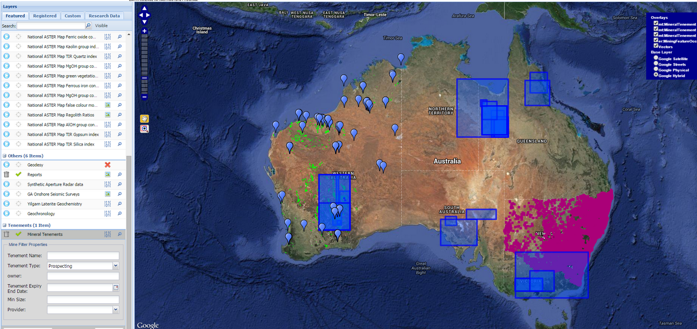

The data services are a collections of web-based services from organisations around Australia that provide geospatial data, such as Geoscience Australia, CSIRO, State Governments and several Universities.

The following sections describe the portal: the first section of this document is an overview of the portal.  Later sections provide details on the portal's operations.  The [Examples](examples) section contains steps to perform common activities.

[CSW]: http://en.wikipedia.org/wiki/Catalog_Service_for_the_Web
[GML]: http://en.wikipedia.org/wiki/Geography_Markup_Language
[OGC]: http://en.wikipedia.org/wiki/Open_Geospatial_Consortium
[SRS]: http://en.wikipedia.org/wiki/Spatial_reference_system
[WCS]: http://en.wikipedia.org/wiki/Web_Coverage_Service
[WFS]: http://en.wikipedia.org/wiki/Web_Feature_Service
[WMS]: http://en.wikipedia.org/wiki/Web_Map_Service
[XML]: http://en.wikipedia.org/wiki/Xml
[ZIP]: http://en.wikipedia.org/wiki/ZIP_%28file_format%29

# Overview

## Data Services

Various organisations provide data to the portal: it may be as simple as satellite imagery or a view into a geospatial database.  The data provided by these servcies are draw as _layers_ overlaying the background map.  Selecting the data to view is managed by the three panels to the left hand side of the window.

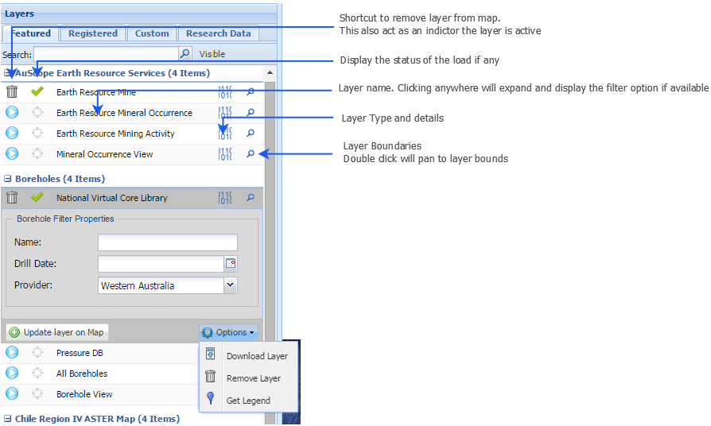

To view a data service you have to:

1. Select the data source from one of the [lists](#layer-collections);
1. Optionally filter the data (for example, a specific mineral type); and
1. Add the data as a map layer.

The three panels implement these steps:

The _Layers_ panel lists the data services that have been registered with the portal.  The services are grouped into several different themes -- see [Layer collections](#layer-collections) below.

The _Filter_ panel is populated when a layer is selected.  Depending on the type or complexity of the layer's data you can filter it to obtain a subset of the original data.  If the data service provides a view into a database you will be able to filter the data by entering specific values for database fields, for example the name of the mineral being mined or selecting the data provider.  Filters include plain text and [wildcards](#wildcards) to match database fields or select lists containing data values fetched from the database or service.

Click the **Add to map** button to apply any filters to the data and display the results on the map.

The _Active layers_ panel shows the layers that are displayed on the map and the order that they are drawn (top to bottom).

 Note that adding a layer may not display the data immediately: the data has to be fetched from the providers and so it may take a few minutes and be displayed in batches.

## Map

The map area is a standard web-based map display: showing a background map with zero or more layers overlaying the map to display selected features. You can zoom in or out by using the mouse wheel and move the map by dragging the mouse around.  The map is based on several standard web technologies provided by:

* [OpenLayers](http://openlayers.org/)
* [Google Maps](https://support.google.com/maps/)

# Portal operations

## Data Services

### Layers

Each row of the _Layers_ panel has four columns:

* Layer description: Click the **plus sign** to display a description of the layer.  Click it a second time to hide the description.
* Layer name: obtained from the data service.
* Layer type icon:  This indicates the type of data being provided by the organisation (see [Layer icons](#layer-icons)). Clicking on the icon will display a pop-up window with details of the data service and the data it provides.
* Boundary: Click the **magnifying glass** to briefly display the boundary rectangle of the data on the map (the boundary will only be drawn on the map for a few seconds). If the data is provided by multiple organisations you may see several boundaries: one for each individual organisation.

#### Searching layers

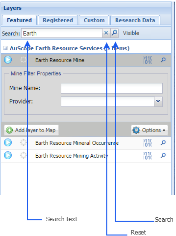

You can search for layers using their name: enter part of the name in the search box and click the **magnifying glass** or press **Enter**.  The list of layers will be reduced to the ones that match the text you entered in the search box.

 The search string matches the beginning of each word in the layer name. For example "bore" will match layers "All Boreholes" and "Borehole view" but will not match "Arboreum."

To remove the search filter in order to see all layers again click the **X** button next to the search box.

#### Layer collections

The tabs at the top of the _Layers_ panel separate the data services into several collections:

* Featured: These data services are registered with the portal and are displayed together using common themes such as Mining, Boreholes and so on.
* Registered: These services are similar to those from the _Featured_ category but do not belong to any of the _Featured_ themes.
* [Custom Layers](#custom-layers): This tab allows you to create your own layers from remote data services (see below).
* Research data: These layers are from past or present research activities and may contain partial or incomplete information.

#### Custom Layers

Custom Layers allow you to add layers from any mapping server in the world. You will need the link (URL) to the web service and enter it into the field in the panel:

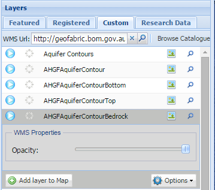

Press **Enter** to connect to the service and the portal will query the service's capabilities.  In the above figure [OpenWeatherMap.org](http://openweathermap.org/) provides precipitation and cloud maps amongst other weather data.  These capabilities are treated like [normal map layer](#data-services) and can be added to the map by selecting the row and click the **Add to map** button.

 Custom Layers are not saved -- you will have to add them again when you revisit the portal.

TODO double check permanent link

 Some [WMS] services are not compatible with the Portal.  They may provide capabilities that are not supported by the portal or provide data in a format that cannot be used.  The most common problem is the service provides data in a "spatial reference system" ( [SRS] ) that is not supported by the mapping software.

[OpenStreetMap]: http://www.openstreetmap.org/
[OpenWeather]: http://openweathermap.org/
[GA Historic flood maps]: http://data.gov.au/dataset/historical-flood-mapping-proof-of-concept

Type of data             | WMS Linky
-------------------------|----------------------------------------------------
[GA Historic flood maps] | http://eos.ga.gov.au/geoserver/NFRIP-WOfS/wms
[OpenStreetMap] example  | http://irs.gis-lab.info/?layers=osm
[OpenWeather]            | http://wms.openweathermap.org/service (not working)

TODO WMS is mentioned in the prompt but are there any other services supported?

#### Layer icons

Layer types are identified using these icons:

*  Data: this is a service that provides geospatial objects such as points and areas, which may provide fields that are used to filter the data being shown on the map.
*  [Portrayal](http://ormdev.opengeospatial.org/node/100): this service provides maps.  Maps are subdivided into tiles at different resolutions -- the mapping software will use the map's zoom level to select the resolution of the map images.

### Filters

Each layer provides different ways to filter the data depending on the structure its data. The following image shows a sample of the filters from three different mining layers. Note that each filter provides fields of several types: plain text, dates and select lists.

* Plain text fields match the data exactly, but case insensitive.  Some data services also support [wildcards](#wildcards) to match portions of the field.
* Date fields are in the format: yyyy-mm-dd and also provide a pop-up calendar to selected the date (invalid dates are indicated with a red border around the input text box).
* Select lists are populated from unique values in the data. TODO is this correct (e.g. does the data and/or service provide items)?

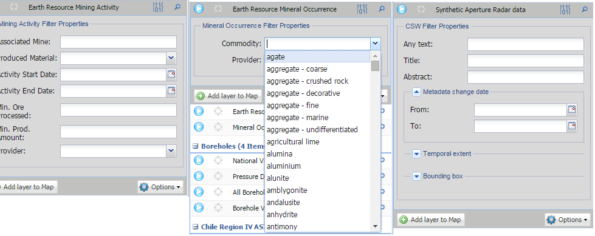

 Some layers may not have any filters.  Layers that supply imagery may only provide a filter to change the layer's opacity when the images are drawn on the map.

 Some layer fields are numeric, for example the amount of ore processed. There are no checks to verify that you have entered a numeric value in these fields. Entering non-numeric will result in either no data or the filter will be ignored.

Click the **Add to map** button to apply any filters to the data and display the results on the map.  If the layer is already active it will be replaced by a layer with the new filter.

 A number of data services provide data from external sources and when they are added to the map a copyright notice will be show.

Click **Reset filter** to reset the filter back to its default values, which is usually no filter.  That is, show all available data.

#### Complex filter example

The following filter is from the _Synthetic Aperture Radar_ data service...

> Raw Synthetic Aperture Radar (SAR) data from ERS-1 and ERS-2 satellites. Data is provided in the standardised CEOS format under licence from the European Space Agency (ESA).

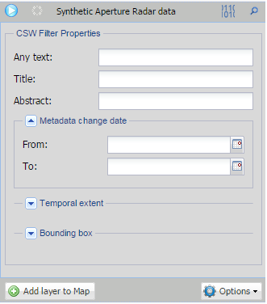

The filter has a complex collection of fields that are used to reduce the amount of data being drawn on the map:

* Text fields that may or may not support [wildcards](#wildcards).
* Groups of fields: fields grouped together in a common theme.  For example the "Temporal extent" group is a time period between the start and end dates.
* Date fields with a pop-up calendar.
* Numeric fields such as the bounding box coordinates (not shown but it asks for minimum & maximum latitudes and longitudes of the bounding box).

#### Wildcards

Wildcards are special characters that allow filters to match all or part of a text field. They may also position the match at the beginning or end of the field.

 A data provider may choose not to implement wildcards (for example, to reduce processing overheads) or limit their behaviour.  This means a filter on a text field _may_ accept any of these matching rules:

1. A strict match of the entire text field, usually case insensitive.
1. A match to any portion of the field.  For example a filter of "old" will match "goldfield lease" and "the folding chair".
1. A "match any" beginning/end wildcard (asterisk: \*). For example "sil\*" will match "silver mine" and "silicon chip". Similarly "\*ts" will match "hot spots" and "polar orbits"
1. A "single character" wildcard (Hash: #). For example "\*9#" will match "bore 295" and "mine number 1294"

### Active layers

The _Active Layers_ panel displays the layers current shown on the map. Each row has six columns:

* Layer description: Click the **plus sign** to display a short description of the layer.  Click it a second time to hide the description.
* Layer colour: the colour used to draw the data from this service. The colour is selected from a fixed palette.
* TODO what does the key icon mean?
* [Processing status](#processing-status): this is an animated graphic to indicate whether data is being fetched and from where (see below).
* Layer name: obtained from the provider.
* Visibility: toggle the check box to temporarily hide or show the layer on the map.
* [Downloading data](#downloading-data): open a pop-up window that will allow you to download the data being displayed (see below).

Some layers may be dragged up or down to change their drawing order.  Click and hold the layer and move it up or down to change the drawing order.  Valid positions for the layer will be indicated as the mouse moves with a green line and arrows pointing inwards:

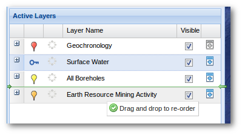

The "drag and drop" hint may change to indicate that you can't position the layer at the current mouse position: .

#### Processing status

This icon is animated when data is being fetched from a provider.  If you hover your mouse over the icon a pop-up window will display details on where the data is coming from and its progress.

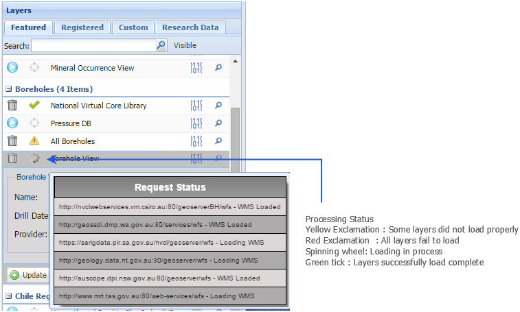

Once the processing has completed (the animation has stopped), clicking on the icon will provide a summary of the data fetched from the provider. The summary will vary depending on what types of data is being provided.  It can include:

* [Features][WFS] : points or areas on the map;
* [Maps][WMS] : with an optional thumbnail; and
* Other data provided by the service.

Actions:

* If the service provides features you should see a link that will show first 5 features that were retrieved from the data service.  Clicking this link will open a new browser window or tab to show the raw [XML] retrieved from the [WFS] service.
* Clicking on a map thumbnail will display the original image.

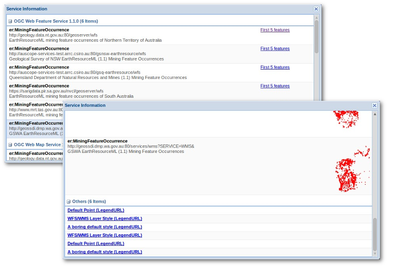

#### Downloading data

If you would like to perform further analysis on the data being viewed in the portal you can download the data to your workstation by clicking the download icon (  ). Depending on the type of data being provided by the service, you will have to complete a number of dialogs to identify the data you want and, possibly, the format of the data.

A sample sequence is show in these screenshots:

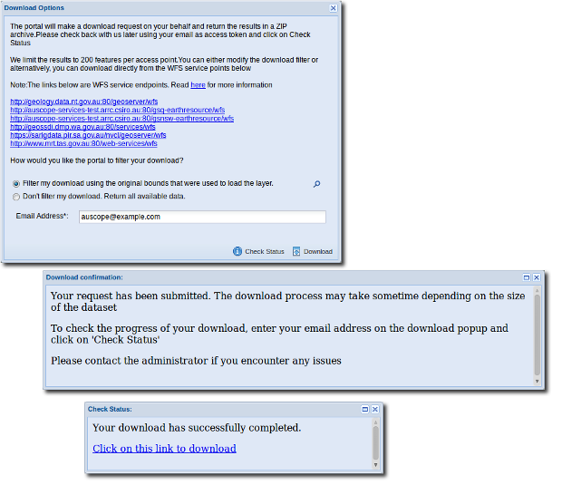

The sequence is usually:

1. Identify the data to be archived for download;
1. Provide an email address (no email is sent, this is just a unique identifier for you);
1. Submit the request by clicking the **Download** button;
1. Use the **Check status** button to report on the status of the download request; and
1. Once **Check status** reports that the processing has finished, download the data by clicking the link in the status dialog message.  The data is usually archived as a [ZIP] file to reduce the file size and package multiple files into one download.

The download uses standard filenames for the [ZIP] files.  They are:

* GMLDownload.zip
    * An archive of [XML] files defining the features from the data source.
    * [Geography Markup Language][GML]
* WCSDownload.zip
    * An archive containing one or more [NetCDF](http://en.wikipedia.org/wiki/Netcdf) files with the selected data.
    * [Web Coverage Service][WCS]
* WMSDownload.zip
    * Map images covering the visible region (you will have the opportunity to specific the image type, for example GeoTIFF, JPEG etc).
    * [Web Mapping Service][WMS]

## Permanent Links

TODO

## Map Navigation

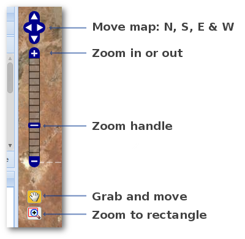

There are several ways to navigate around the map.

* Using the map controls:
    * Click the arrows to move the map North, South, East or West.
    * Click the **plus** or **minus** signs to zoom in or out.
    * Drag the zoom handle up or down.

* Special controls:
    * The rectangle icon  lets you draw a rectangle on the map which will then zoom to provide the best view of the selected area.
    * Click the hand icon  to reset the mouse in order to drag the map around.  This is automatically done after zooming to a rectangle.

* Using the mouse:
    * Move the map: hold the left-mouse button down and move the mouse.
    * Zoom in and out: use the mouse's scroll wheel.

# Examples

## National Virtual Core Library

The National Virtual Core Library (NVCL) is a geospatial database holding high resolution pictures of drill samples to help explore the mineralogy and composition of the upper 1-2 km of the Australian continent.  The drill samples in the library come from a number of sources including State agencies and industry.

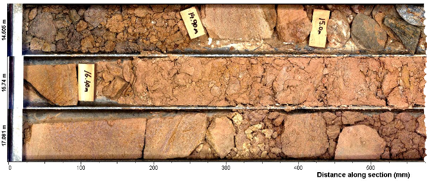

The following steps displays the NVCL data on the portal's map and views the details for one of the core samples.

1. Select the **National Virtual Core Library** from the list of [layers](#layers).
1. Click on the **Add to Map** button to draw the data points on the map.  You may also filter the data to a subset using the options in the [filter](#filters) panel (remember to select the filters _before_ adding the layer to the map).

    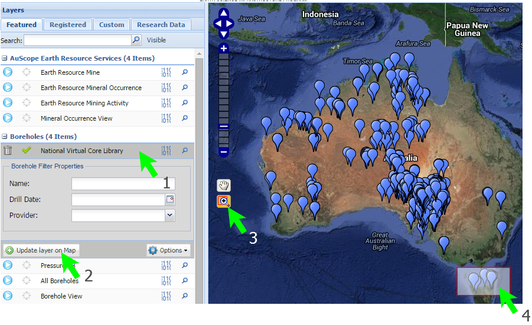

1. Zoom in to a region by selecting the [rectangle tool](#map-navigation); and
1. Draw a rectangle on the map -- in this case the top of Tasmania.  The map will zoom to that area.

    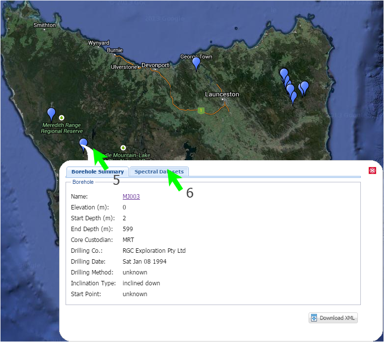

1. Click on a location/pin and the summary of the core's data will be displayed in a pop-up window.
1. Click on the **Spectral Datasets** tab to view pictures and [measurements](#scalars) taken of the core. By default, the detail window will show thumbnail images of each core section. Clicking a thumbnail will show the original picture for that section in a new browser window or tab.

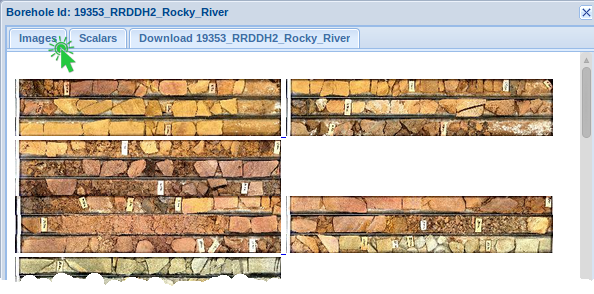

### Scalars

The _Scalars_ tab of the **Spectral Datasets** shows all datasets obtained from measurements of the core samples. For example infra-red spectroscopy measurements of the samples.

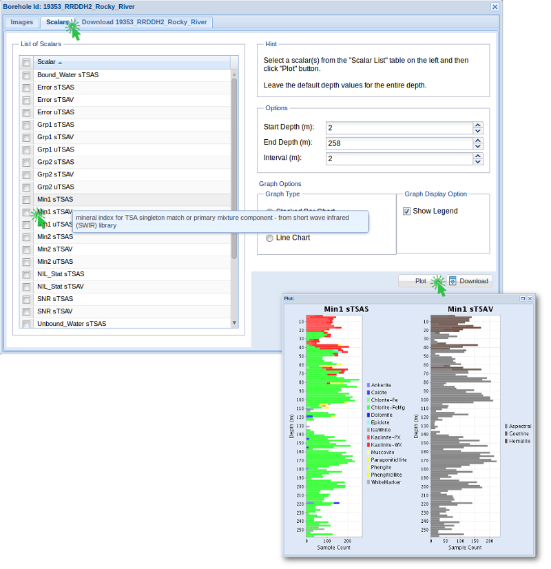

Clicking the _Scalars_ tab displays the list of available measurements on the left-hand side of the window -- you can see a brief description of them by hovering the mouse over each item. You can plot the measurements by selecting one or more scalars and clicking the **Plot** button.

On the right-hand side of the window are some options that affect how the plot is drawn:

* You can filter the data by depth -- minimum and maximum depth in metres;
* Change the display interval. For example display the results from every 2 metres;
* Hide or show the plot legend; and
* Change the type of plot type: bar or line chart.

---

# Glossary

Term        | Meaning
------------|------------------------------------------------------
[CSW]       |   Catalog Service for the Web (Catalog Service - Web)
GA          |   [Geoscience Australia](http://www.ga.gov.au/)
[GML]       |   Geography Markup Language
[OGC]       |   Open Geospatial Consortium
[SRS]       |   Spatial Reference System
[WCS]       |   Web Coverage Service
[WFS]       |   Web Feature Service
[WMS]       |   Web Mapping Service
[XML]       |   Extensible Markup Language
